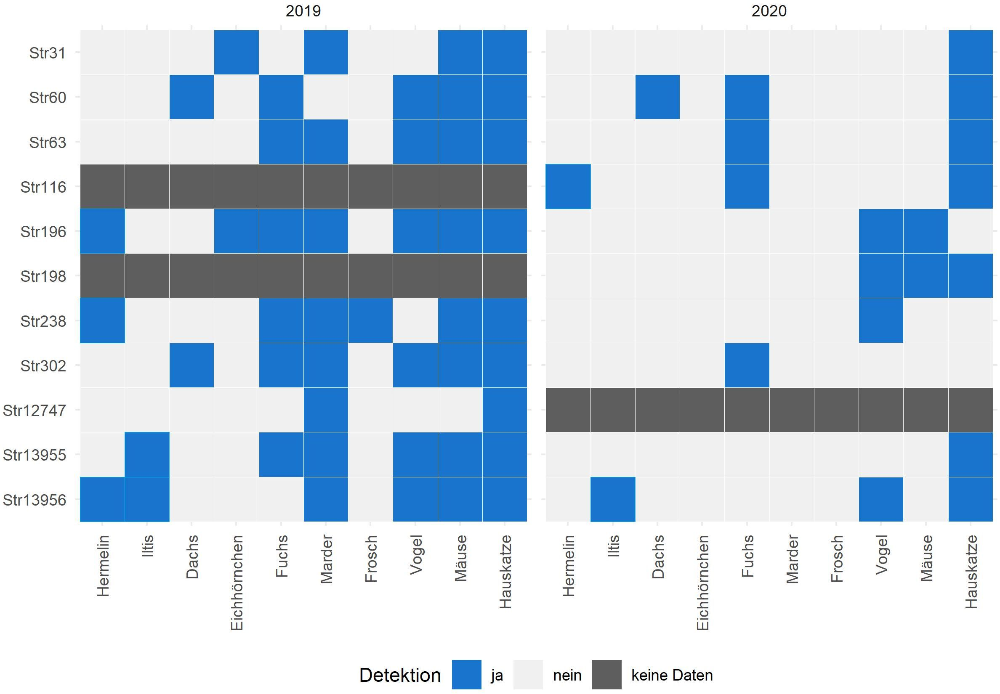
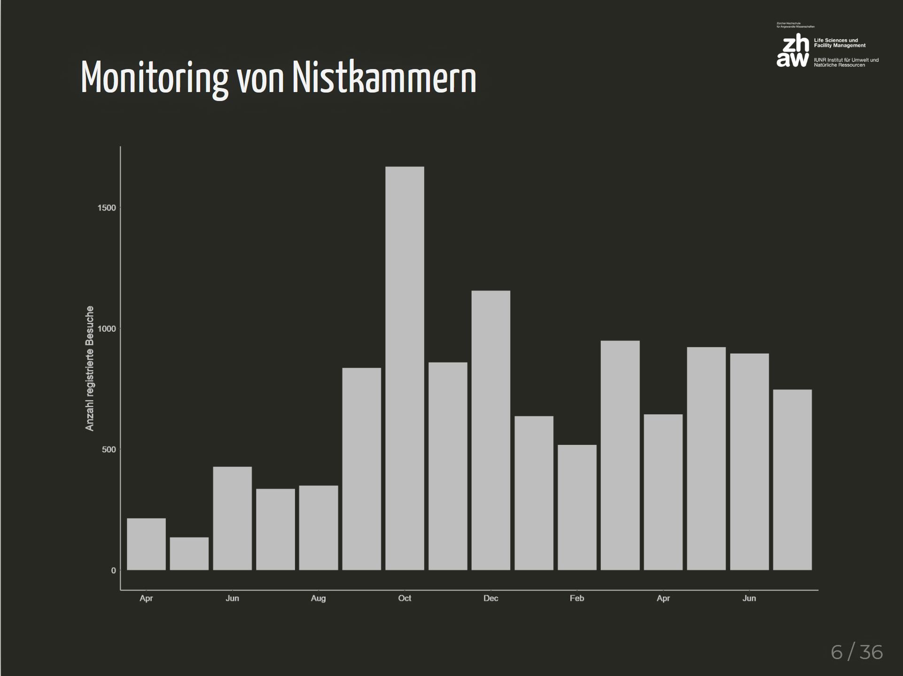

<link href="cards.css" rel="stylesheet">


```{r, echo = FALSE}
knitr::opts_chunk$set(echo = FALSE)
```

### Wiesel & Co Erfolskontrolle

2019 und 2020 hat die ZHAW im Auftrag von Wiesel & Co am Zimmerberg die Erfolgskontrolle im Projekt durchgeführt.

[forschung.wieselundco.ch/erfolgskontrolle](https://forschung.wieselundco.ch/erfolgskontrolle)


```{r}

```


### WIN Treffen 2021

Anfangs 2021 veranstaltete WIN Wieselnetz das jährliche Treffen für Leiter von Wieselprojekten. Nils erzählte von aktuellen Forschungsprojekten an der ZHAW.  

[forschung.wieselundco.ch/WIN_2021](https://forschung.wieselundco.ch/WIN_2021/)


```{r}

```


### WIN Treffen 2018

Nils erzählt von aktuellen Projekten und Vorhaben rund um das Thema Wieselforschung an der ZHAW. 


[forschung.wieselundco.ch/WIN_2018](http://forschung.wieselundco.ch/WIN_2018/)

```{r}
knitr::include_graphics("images/WIN_2018.jpg")
```

